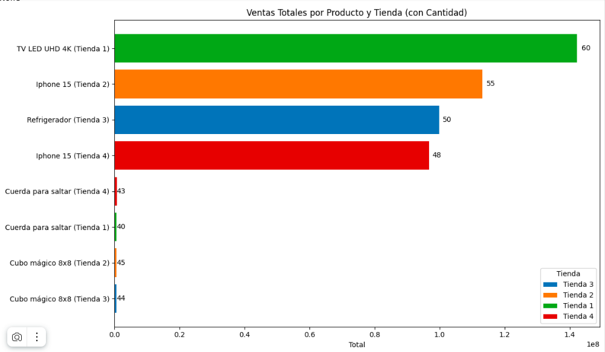
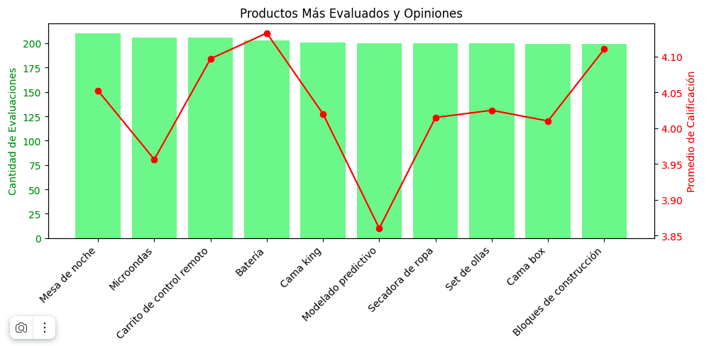
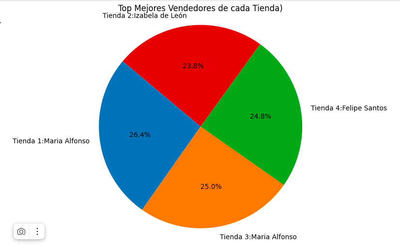

# Curso Practicando Python para Data Science: 
Challenge No 1 - Alura Store

## La estructura del proyecto y organización de los archivos.

El proyecto consiste de un Colab-book y 4 archivos CVS con informacion de las ventas por cada tienda. 

## Ejemplos de gráficos e insights obtenidos:
1. Ingreso total por cada tienda
2. Ventas de cada tienda
4. Categorias Destacadas de todas las tiendas
5. Costes de Envío
6. Calificaciones de Productos
7. Vendedores Destacados
   
    
   
   
   
   
   
## Instrucciones para ejecutar el notebook.
Debe ser ejecutado dentro de un entrono de Colab.
